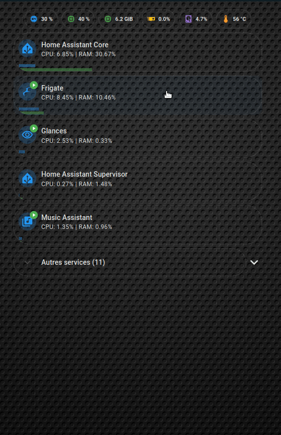

# ha-ressource-monitoring

Carte de monitoring avancée pour Home Assistant permettant de suivre en temps réel les ressources (CPU/RAM) de l'hôte et des Add-ons (**Home Assistant Supervisor**).



## Filtres & Tri Dynamique
- **Host Monitoring** : Affichage des constantes vitales (CPU, RAM, Disque, Température) via des Chips.
- **Top Add-ons** : Classement automatique des services par consommation.
- **Interactivité** : Double-clic pour démarrer/arrêter un Add-on (avec sécurité contre les erreurs).
- **Design Pill** : Bords arrondis 33px et transparence totale avec contours fins.

## Pré-requis

### Cartes Lovelace (via [HACS](https://hacs.xyz/))
- 🍄 [Mushroom Cards](https://github.com/piitaya/lovelace-mushroom)
- 🗂️ [Auto-entities](https://github.com/thomasloven/lovelace-auto-entities)
- 🎨 [Card-mod](https://github.com/thomasloven/lovelace-card-mod)
- 📂 [Fold-entity-row](https://github.com/thomasloven/lovelace-fold-entity-row)

### Packs d'Icônes (via [HACS](https://hacs.xyz/))
Certaines icônes premium utilisées dans la carte nécessitent l'installation de ces packs :
- 📦 [Plug-and-Hyve Icons (phu)](https://github.com/Mariusthvdb/phu-icons)
- 💎 [Material Symbols (m3r, m3rf)](https://github.com/beecho01/material-symbols)

### Intégrations Requises
- **Home Assistant Supervisor** : Fournit les statistiques CPU/RAM des Add-ons et les entités de contrôle (Start/Stop).
- **Glances** : Crucial pour les métriques de l'Hôte dans les Chips (Utilisation RAM en % et GiB, Utilisation Disque).
- **System Monitor** : Fournit les métriques Host de base (Usage CPU moyen, Température processeur).

## Installation

### 1. La Carte (Frontend)
Créez une carte **Manuel** et collez le contenu de [monitoring_card.yaml](cards/monitoring_card.yaml).

### 2. Le Rafraîchissement Turbo (Backend)
Pour une réactivité à 5 secondes (recommandé si vos capteurs sont exclus du recorder), importez l'automation [turbo_refresh.yaml](automations/turbo_refresh.yaml).

## Analyse détaillée du code

Le code de la carte (YAML) utilise le moteur de template Jinja2 de Home Assistant pour automatiser la gestion des entités. Voici le découpage par étapes :

### 1. Collecte et Filtrage initial
On commence par isoler tous les capteurs CPU des Add-ons en excluant les entités parasites.
```jinja

```
- **Inclusion** : On capture les entités se terminant par `cpu_percent` (Supervisor anglais) ou `pourcentage_du_processeur` (Supervisor français).
- **Exclusion** : On élimine les entités parasites liées à la virtualisation (Proxmox, QEMU, nœuds réseau).
- **Persistance** : Contrairement à d'autres solutions, cette carte conserve les Add-ons arrêtés (`unavailable`) dans la liste pour vous permettre de les relancer d'un simple double-clic.

### 2. Reconstruction intelligente des entités
Pour chaque capteur trouvé, le code "devine" les chemins des autres entités (RAM, Switch et Statut) en essayant les suffixes courants (`_running` ou `_en_cours_d_execution`).
```jinja



```
C'est ce qui garantit l'affichage du badge Play/Stop pour tous les services, incluant VS Code ou File Editor.

### 3. Calcul de Priorité et Tri (Sticky-Bottom pour les inactifs)
Pour savoir quel Add-on doit figurer dans le **Top 5**, on calcule la valeur maximale entre son CPU et sa RAM. Si l'Add-on est détecté comme arrêté (`off`), on lui donne une priorité de `-1` pour le forcer à descendre en bas de liste.
```jinja

```
Puis on trie la liste finale par cette `priority`.
```jinja

```

### 4. Répartition Top 5 et Reste
On divise la liste en deux groupes pour garder un dashboard propre.
```jinja


  {# ... génération de la carte Mushroom ... #}
  
    
  
    
  

```

### 5. Assemblage final
On fusionne le Top 5 permanent avec un bloc `custom:fold-entity-row` (en bas) qui contient tout le reste de la liste, camouflé derrière un menu déroulant.
L'entité `sw_ent` est reconstruite dynamiquement pour chaque Add-on à partir de son nom de capteur CPU.

### 4. Attribution Automatique des Icônes
Une liste de correspondances (`icons`) au début du code permet d'associer des icônes spécifiques aux noms des Add-ons (ex: *Frigate*, *ESPHome*, etc.). Si un Add-on n'est pas dans la liste, une icône par défaut est utilisée.

## Remarques
Les icônes sont attribuées dynamiquement par mots-clés dans le template de la carte. Si un Add-on n'est pas reconnu, il utilisera une icône par défaut ou vous pouvez l'ajouter dans la liste `icons` au début du code YAML.

## Licence
Ce projet est sous licence MIT. N'hésitez pas à l'adapter et à le partager !
